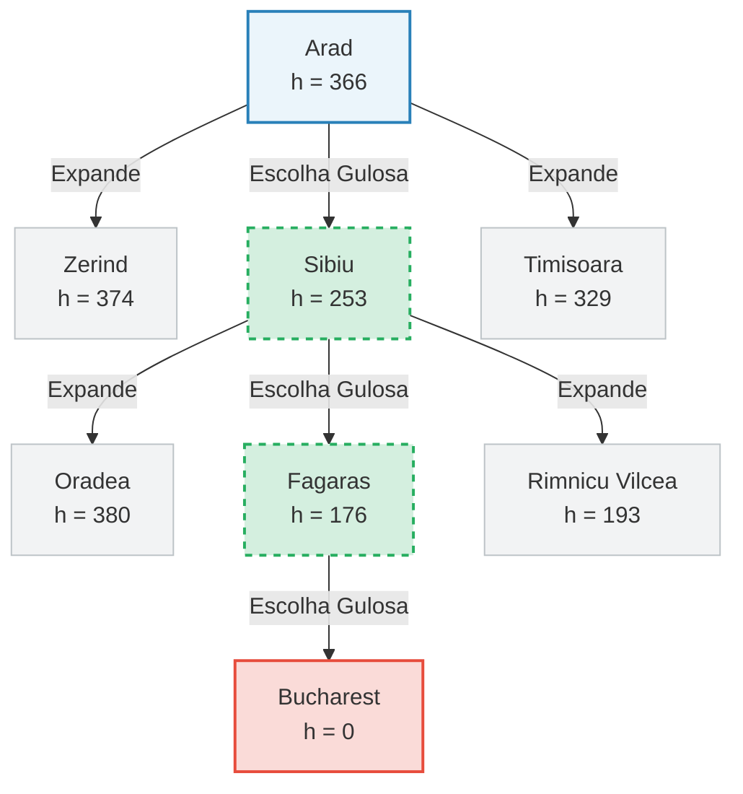

# Busca Gulosa
Este repositório contém a implementação em Python do algoritmo de Procura Gulosa pela Melhor Escolha, um método de procura informada (heurística) aplicado ao clássico problema de navegação no mapa da Roménia (Capítulo 3 do livro Inteligência Artificial: Uma Abordagem Moderna, de Stuart Russell e Peter Norvig).

## 🧠 Como Funciona a Procura Gulosa?
A Procura Gulosa tenta encontrar o caminho até ao objetivo expandindo sempre o nó que parece estar mais próximo do destino, sem considerar o custo que já foi pago para chegar até ali.
A sua função de avaliação é extremamente simples: f(n) = h(n)  
  
Onde:  
h(n): É a função heurística que estima a distância em linha reta do nó n até ao objetivo. No caso deste projeto, a heurística é a distância em linha reta até Bucareste.

## ⚠️ Limitações Importantes
O algoritmo não garante encontrar o caminho mais curto real (em quilómetros de estrada), porque ignora o custo das arestas (estradas) já percorridas (g(n)).  
Dependência da Heurística: O algoritmo toma decisões baseadas numa heurística fixa para Bucareste. Se o objetivo for alterado para outra cidade (como Hirsova), o algoritmo continuará a tomar decisões baseadas em "quem está mais perto de Bucareste", o que pode gerar rotas ineficientes.

## 🛠️ Análise Estrutural do Código
O código está estruturado para ser didático, ilustrando o estado da fronteira passo a passo.  
  
Os seus componentes principais são:  
Grafo (mapa_romenia): Dicionário de adjacências que mapeia cada cidade aos seus vizinhos diretos e à distância real da estrada.  
Heurística (heuristica_bucareste): Tabela de consulta contendo as distâncias em linha reta até Bucareste.  
Fronteira (fronteira): Uma lista de tuplas estruturada como (valor_h, cidade_atual, caminho_percorrido).  
O Coração Mecânico: Ordenação por Heurística  
A cada iteração, a fronteira é reordenada de forma crescente utilizando uma função lambda para garantir que o nó com a menor distância estimada fique no topo (índice 0):  
# Ordena a fronteira pelo menor valor h(n)  
fronteira.sort(key=lambda x: x[0])


Desta forma, a chamada subsequente fronteira.pop(0) garante a seleção imediata e "gulosa" do nó mais promissor.

## 🚀 Como Executar o Código  
Pré-requisitos  
Python 3.x instalado no seu sistema.  
Instruções: 
Guarde o código fornecido num ficheiro chamado busca_gulosa.py e execute o seguinte comando no terminal:  
```
python busca_gulosa.py
```

Exemplo de Fluxo de Execução Correto (Origem: Arad -> Destino: Bucharest)
Ao executar a procura de Arad para Bucareste, o algoritmo utilizará a heurística para guiar o fluxo.
Abaixo está o diagrama representativo da árvore de decisão gerada pelo algoritmo. Os nós verdes representam o caminho ótimo selecionado pela heurística h, enquanto os nós cinzentos representam as alternativas descartadas por terem valores de heurística mais elevados:



Passo a Passo Detalhado:  

```
1. Arad (h = 366) expande para Sibiu, Timisoara e Zerind. Escolhe Sibiu por ter o menor h (253).
2. Sibiu (h = 253) expande para Arad, Oradea, Fagaras e Rimnicu Vilcea. Escolhe Fagaras por ter o menor h (176).  
3. Fagaras (h = 176) expande para Sibiu e Bucharest. Escolhe Bucharest por ter o menor h (0).  
4. O teste de objetivo é satisfeito em Bucareste e o algoritmo termina com sucesso.
```
  
```
Caminho Final Retornado:
Arad -> Sibiu -> Fagaras -> Bucharest
```


# 📊 Propriedades do Algoritmo
| Propriedade | Classificação | Explicação |
|-------------|---------------|------------|
| Completo? | Sim (com controle de Visitas) | O uso do conjunto visitados impede loops infinitos em grafos finitos. |
| Ótimo? | ❌ Não | Ignora a distância real acumulada das estradas, podendo escolher caminhos mais longos no total. |
| Complexidade de Tempo | O(b^m) | No pior caso, pode explorar caminhos desnecessários se a heurística for imprecisa. |
| Complexidade de Espaço | O(b^m) | Mantém todos os nós gerados na memória dentro da fronteira. | 
